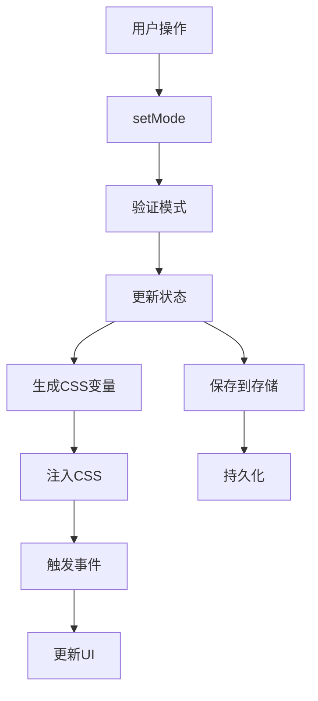

# 核心概念

理解 **@ldesign/size** 的核心概念将帮助你更好地使用这个库。本指南将深入介绍系统的设计理念和核心组件。

## 🎯 设计理念

### 用户体验优先

@ldesign/size 的核心理念是**让每个用户都能获得最适合自己的界面体验**：

- **视觉障碍用户** 需要更大的字体和控件
- **老年用户** 偏好更大的界面元素
- **移动设备用户** 需要适合触摸的尺寸
- **高分辨率屏幕用户** 需要更精细的显示

### 开发者友好

- **零配置启动** - 开箱即用的默认配置
- **渐进增强** - 可以逐步添加高级功能
- **类型安全** - 完整的 TypeScript 支持
- **框架无关** - 核心功能不依赖任何框架

### 性能优先

- **轻量级** - 核心库体积小，运行时开销低
- **智能缓存** - 避免重复计算和DOM操作
- **按需加载** - 支持按需加载功能模块

## 🏗️ 架构设计

### 分层架构

```
┌─────────────────────────────────────────┐
│                应用层                    │
│  Vue Components, Composables, Plugins  │
├─────────────────────────────────────────┤
│                API层                    │
│     便捷API, 快捷函数, 工具方法          │
├─────────────────────────────────────────┤
│                核心层                    │
│  SizeManager, CSS生成器, 事件系统       │
├─────────────────────────────────────────┤
│                基础层                    │
│    类型定义, 工具函数, 常量配置          │
└─────────────────────────────────────────┘
```

### 核心组件

#### 1. SizeManager (尺寸管理器)

负责管理尺寸状态和配置：

```typescript
interface SizeManager {
  // 状态管理
  getCurrentMode: () => SizeMode
  setMode: (mode: SizeMode) => void
  getConfig: (mode?: SizeMode) => SizeConfig

  // CSS 管理
  generateCSSVariables: () => Record<string, string>
  injectCSS: () => void
  removeCSS: () => void

  // 事件管理
  onSizeChange: (callback: SizeChangeCallback) => () => void

  // 生命周期
  destroy: () => void
}
```

#### 2. CSS Generator (CSS生成器)

负责生成CSS变量：

```typescript
interface CSSGenerator {
  generate: (config: SizeConfig, prefix: string) => Record<string, string>
  generatePreset: (mode: SizeMode) => Record<string, string>
  mergeVariables: (...variables: Record<string, string>[]) => Record<string, string>
}
```

#### 3. CSS Injector (CSS注入器)

负责将CSS变量注入到页面：

```typescript
interface CSSInjector {
  inject: (variables: Record<string, string>, selector: string) => void
  remove: (selector: string) => void
  isInjected: (selector: string) => boolean
  update: (variables: Record<string, string>, selector: string) => void
}
```

#### 4. Storage Manager (存储管理器)

负责持久化存储：

```typescript
interface StorageManager {
  get: <T>(key: string, defaultValue?: T) => T | null
  set: <T>(key: string, value: T) => void
  remove: (key: string) => void
  clear: () => void
  has: (key: string) => boolean
}
```

## 🎨 尺寸模式系统

### 预设模式

| 模式 | 字体大小 | 间距 | 边框圆角 | 适用场景 |
|------|----------|------|----------|----------|
| `small` | 12px | 6px | 3px | 移动设备、紧凑布局 |
| `medium` | 14px | 8px | 4px | 桌面设备、标准布局 |
| `large` | 16px | 12px | 6px | 大屏设备、无障碍访问 |

### 配置结构

```typescript
interface SizeConfig {
  // 基础字体
  fontSize: string
  fontSizeSmall: string
  fontSizeLarge: string
  lineHeight: string

  // 间距系统
  spacing: string
  spacingSmall: string
  spacingLarge: string

  // 边框系统
  borderRadius: string
  borderWidth: string

  // 组件尺寸
  buttonHeight: string
  buttonPadding: string
  inputHeight: string
  inputPadding: string

  // 视觉效果
  boxShadow: string
  transitionDuration: string
  transitionEasing: string
}
```

### 扩展性设计

```typescript
// 自定义模式
type CustomSizeMode = 'extra-small' | 'extra-large' | 'compact' | 'comfortable'

// 扩展配置
interface ExtendedSizeConfig extends SizeConfig {
  // 自定义属性
  iconSize: string
  avatarSize: string
  cardPadding: string
}
```

## 🔄 状态管理

### 状态流转



### 事件系统

```typescript
interface SizeChangeEvent {
  previousMode: SizeMode
  currentMode: SizeMode
  timestamp: number
  source: 'user' | 'auto' | 'responsive'
}

// 事件监听
manager.onSizeChange((event: SizeChangeEvent) => {
  console.log(`尺寸从 ${event.previousMode} 变更为 ${event.currentMode}`)
})
```

### 响应式更新

```typescript
// Vue 响应式集成
const { currentMode } = useSize()

// 自动更新UI
watchEffect(() => {
  console.log('当前模式:', currentMode.value)
})
```

## 🎨 CSS 变量系统

### 命名规范

CSS变量采用统一的命名规范：

```css
/* 格式: --{prefix}-{category}-{property} */
--ls-font-size          /* 基础字体大小 */
--ls-font-size-small    /* 小字体大小 */
--ls-font-size-large    /* 大字体大小 */

--ls-spacing            /* 基础间距 */
--ls-spacing-small      /* 小间距 */
--ls-spacing-large      /* 大间距 */

--ls-button-height      /* 按钮高度 */
--ls-button-padding     /* 按钮内边距 */
--ls-button-font-size   /* 按钮字体大小 */
```

### 层级系统

```css
/* 全局变量 */
:root {
  --ls-font-size: 14px;
  --ls-spacing: 8px;
}

/* 组件级变量 */
.my-component {
  --ls-local-padding: calc(var(--ls-spacing) * 2);
}

/* 状态变量 */
.my-component:hover {
  --ls-local-scale: 1.05;
}
```

### 计算属性

```css
.my-element {
  /* 基于基础变量计算 */
  padding: calc(var(--ls-spacing) * 1.5);
  margin: calc(var(--ls-spacing) / 2);

  /* 组合多个变量 */
  border: var(--ls-border-width) solid var(--ls-border-color);
  border-radius: var(--ls-border-radius);
}
```

## 🔌 插件系统

### 插件接口

```typescript
interface SizePlugin {
  name: string
  version: string
  install: (manager: SizeManager, options?: any) => void
  uninstall?: (manager: SizeManager) => void
}
```

### 内置插件

#### Vue 插件

```typescript
const VueSizePlugin: SizePlugin = {
  name: 'vue-size',
  version: '1.0.0',
  install(manager, options) {
    // 注册全局组件
    // 提供 Composition API
    // 集成响应式系统
  }
}
```

#### 响应式插件

```typescript
const ResponsivePlugin: SizePlugin = {
  name: 'responsive',
  version: '1.0.0',
  install(manager, options) {
    // 监听媒体查询
    // 自动调整尺寸
    // 设备检测
  }
}
```

### 自定义插件

```typescript
const MyCustomPlugin: SizePlugin = {
  name: 'my-custom-plugin',
  version: '1.0.0',
  install(manager, options) {
    // 扩展功能
    manager.addCustomMethod = () => {
      // 自定义逻辑
    }

    // 监听事件
    manager.onSizeChange((event) => {
      // 自定义处理
    })
  }
}

// 使用插件
manager.use(MyCustomPlugin, { /* 选项 */ })
```

## 🔄 生命周期

### 初始化流程

```typescript
// 1. 创建管理器
const manager = createSizeManager(options)

// 2. 加载存储的偏好
const storedMode = storage.get('size-mode')

// 3. 设置初始模式
manager.setMode(storedMode || options.defaultMode)

// 4. 生成并注入CSS
if (options.autoInject) {
  manager.injectCSS()
}

// 5. 启动响应式监听
if (options.enableResponsive) {
  startResponsiveWatcher()
}
```

### 销毁流程

```typescript
// 1. 移除事件监听器
manager.removeAllListeners()

// 2. 清理CSS注入
manager.removeCSS()

// 3. 停止响应式监听
stopResponsiveWatcher()

// 4. 清理存储
if (options.clearOnDestroy) {
  storage.clear()
}

// 5. 释放资源
manager.destroy()
```

## 🎯 最佳实践

### 1. 单一职责

每个组件只负责一个特定的功能：

```typescript
// ✅ 好的做法
const fontManager = createFontSizeManager()
const spacingManager = createSpacingManager()

// ❌ 避免的做法
const everythingManager = createEverythingManager()
```

### 2. 配置分离

将配置与逻辑分离：

```typescript
// config.ts
// main.ts
import { sizeConfig } from './config'

export const sizeConfig = {
  defaultMode: 'medium',
  enableStorage: true
}
const manager = createSizeManager(sizeConfig)
```

### 3. 类型安全

充分利用 TypeScript 的类型系统：

```typescript
// 定义严格的类型
type StrictSizeMode = 'small' | 'medium' | 'large'

// 使用类型守卫
function isSizeMode(value: string): value is StrictSizeMode {
  return ['small', 'medium', 'large'].includes(value)
}
```

## 🔗 相关概念

- [尺寸模式详解](./size-modes) - 深入了解尺寸模式系统
- [响应式设计](./responsive) - 响应式设计原理
- [Vue 集成](./vue-plugin) - Vue 框架集成概念
- [API 设计](../api/core) - API 设计原理
